# Simple Dark Theme

A minimalist theme suite for focus. Includes Simple Dark & Light Soft (Eye-friendly) modes.

Designed with a specific color philosophy to reduce cognitive load and improve code readability.

## Design Philosophy

- **Function-First**: Functions are **Green**, Parameters are **Orange**. This consistent pattern helps you quickly parse code structure.
- **Semantic Clarity**: Distinct colors for native objects (`DeepSkyBlue`) vs custom types (`Cyan`), making it easy to distinguish built-in types from your own.
- **Accessibility First**: All four themes achieve **WCAG AA contrast compliance** for code syntax colors. Dark mode body text calibrated to 8.6:1 for comfortable long-form reading.
- **Design Consistency**: All themes share a unified color palette, ensuring consistent semantic meaning across dark and light modes.

## Available Themes

1.  **Simple Dark**
    *   The standard, balanced dark theme. Perfect for daily use.
2.  **Simple Dark Soft**
    *   Lower saturation, softer contrast. Easy on the eyes for long coding sessions.
3.  **Simple Light**
    *   A clean, high-contrast light theme.
    *   Optimized for readability with darker syntax colors (Green/Orange) on a light background.
    *   Includes specific semantic highlighting (e.g., Red strings) to distinguish from functions.
4.  **Simple Light Soft**
    *   **Eye-Care Focused**: Uses the classic macOS Safari Reader Mode background (`#FAF5E8`) to reduce blue light and eye strain.
    *   **Paper-Like Experience**: A warm, low-glare environment perfect for long reading and writing sessions.
    *   **Accessible**: All syntax colors calibrated to WCAG AA contrast standards on the warm paper background.

## Screenshots

### Editor Appearance

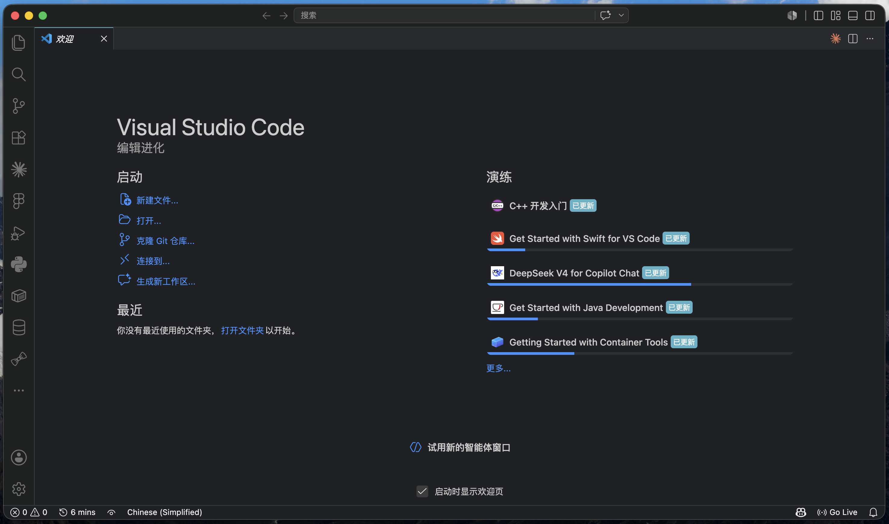
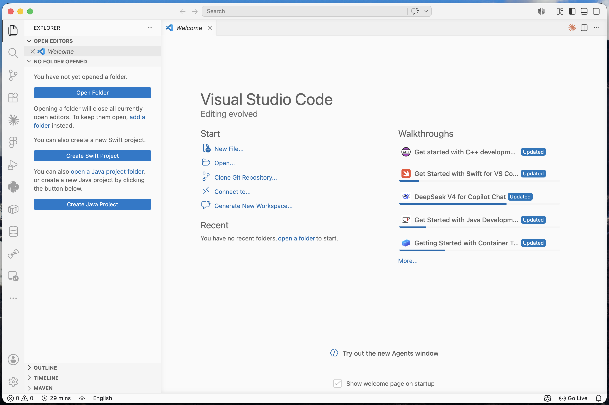
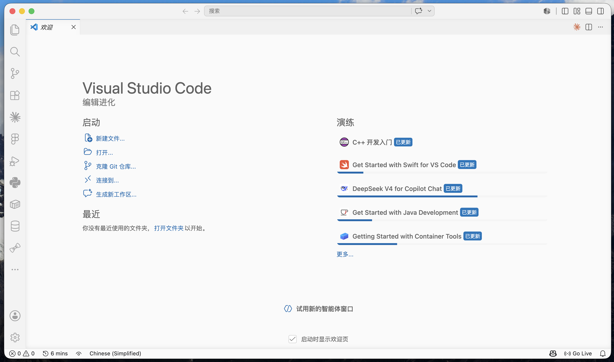

### TypeScript

| Simple Dark | Simple Light | Simple Light Soft |
|-------------|-------------|-------------------|
| 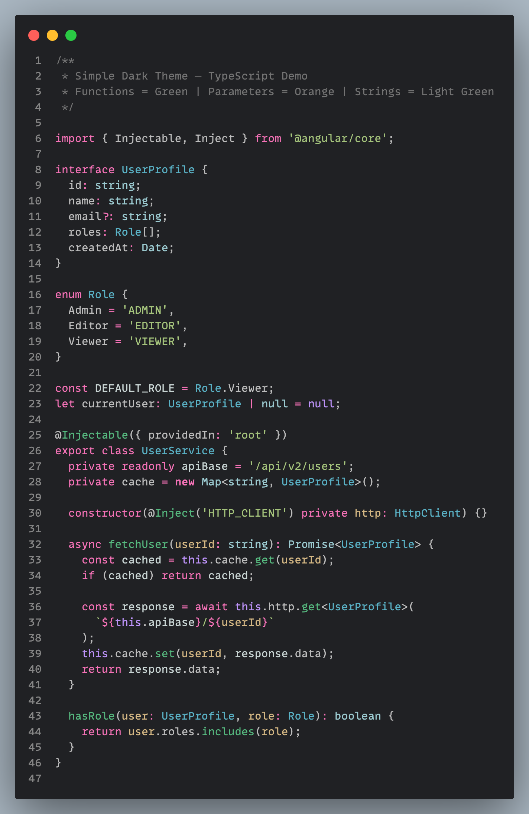 | 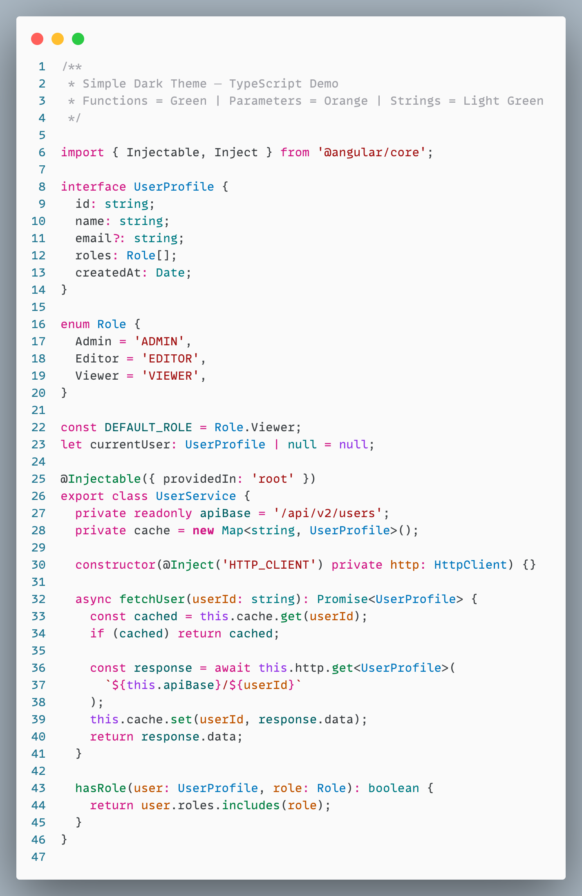 | 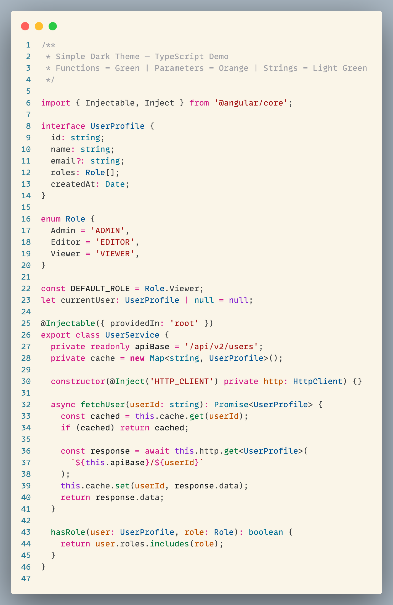 |

### C#

| Simple Dark | Simple Light | Simple Light Soft |
|-------------|-------------|-------------------|
| 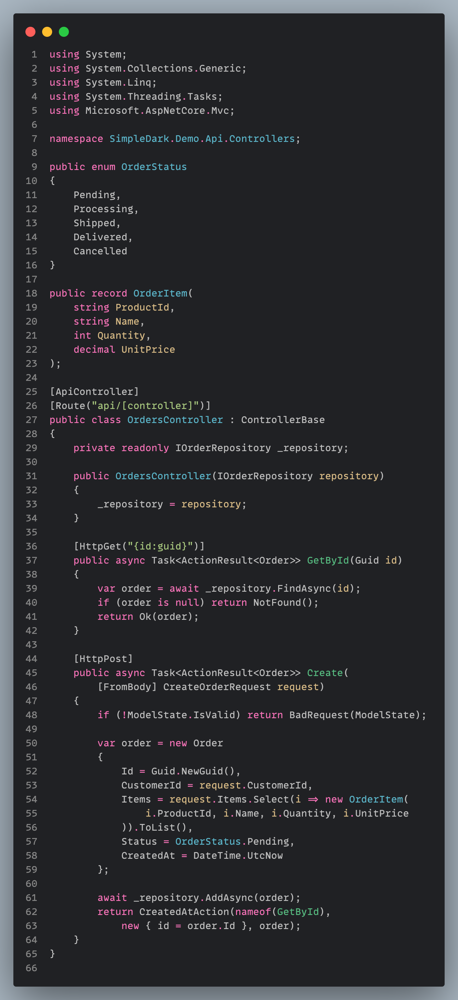 | 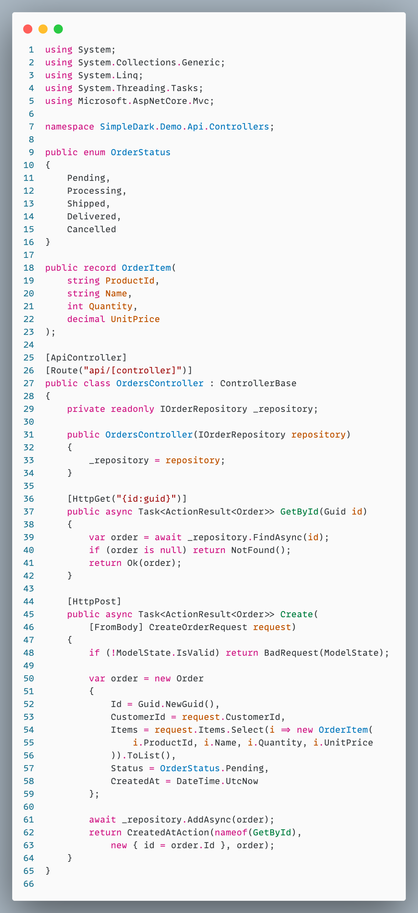 | 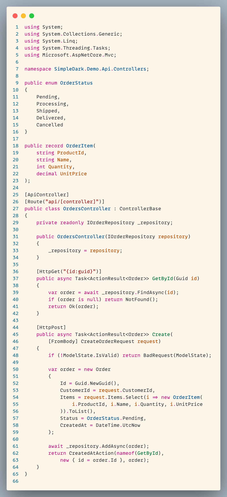 |

### Python

| Simple Dark | Simple Light | Simple Light Soft |
|-------------|-------------|-------------------|
| 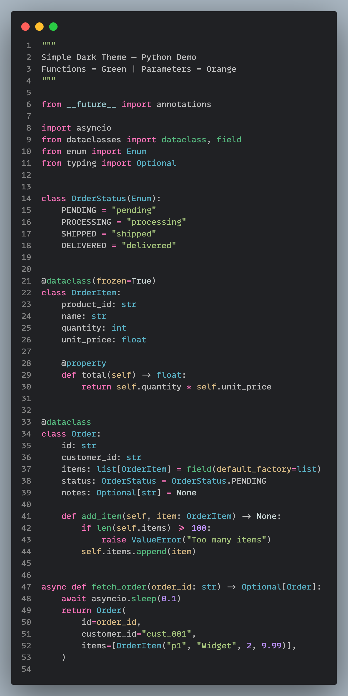 | 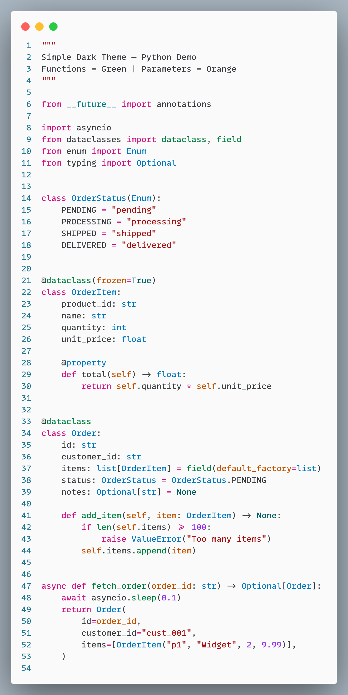 | 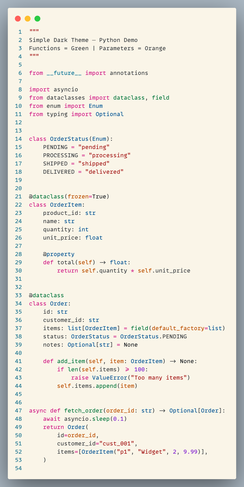 |

### HTML

| Simple Dark | Simple Light | Simple Light Soft |
|-------------|-------------|-------------------|
| 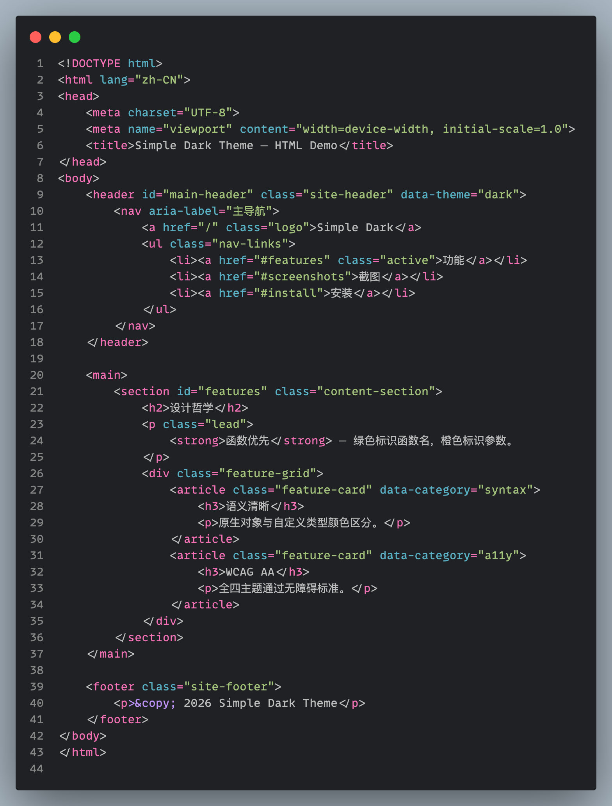 | 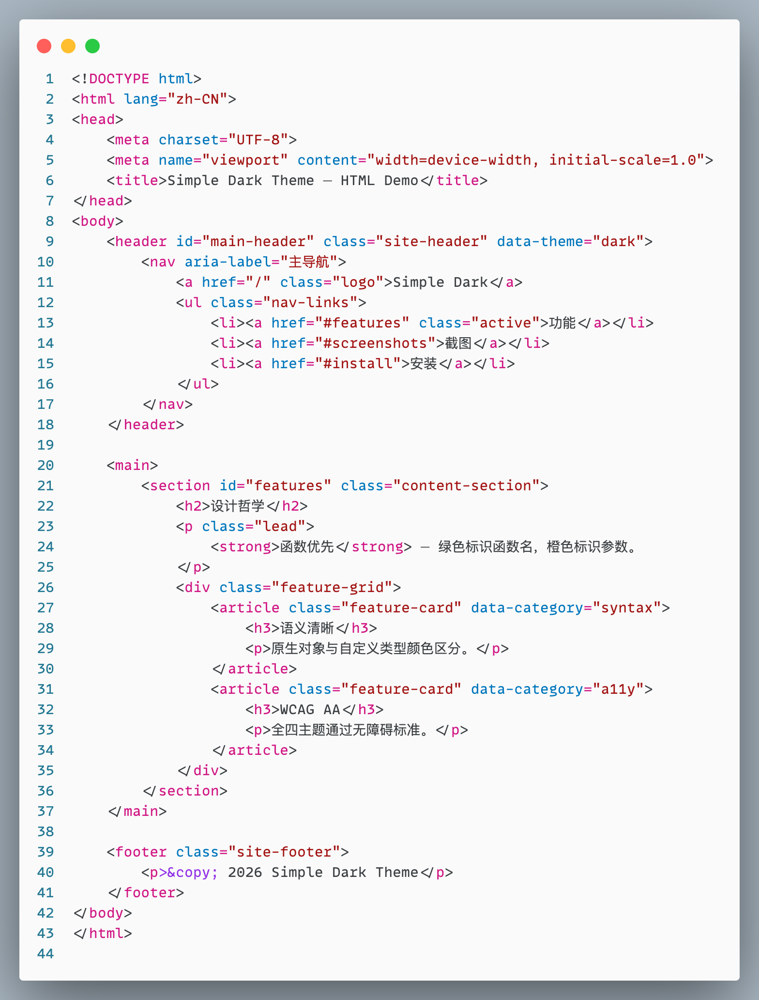 | 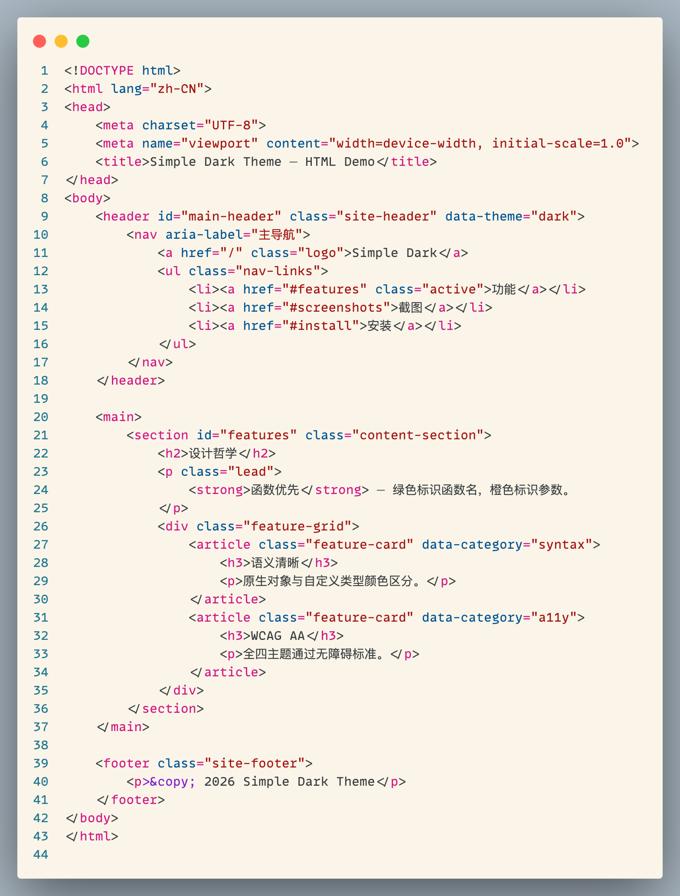 |

## Installation

1.  Open **Extensions** sidebar in VS Code.
2.  Search for `Simple Dark`.
3.  Click **Install**.
4.  Press `Cmd+K Cmd+T` (macOS) or `Ctrl+K Ctrl+T` (Windows/Linux) and select one of the **Simple** themes.

## Customization

You can customize specific colors in your `settings.json`:

### Workbench Colors (UI)

```json
"workbench.colorCustomizations": {
  "[Simple Dark]": {
    "tab.activeBorder": "#ff0000",
    "sideBar.background": "#202124"
  },
  "[Simple Light]": {
    "sideBar.background": "#fafafa"
  }
}
```

### Syntax Highlighting

```json
"editor.tokenColorCustomizations": {
  "[Simple Dark]": {
    "functions": "#00E673"
  },
  "[Simple Light]": {
    "functions": "#048043"
  }
}
```

## Feedback

If you like this theme, please give it a star on GitHub!
Issues and Pull Requests are welcome.
